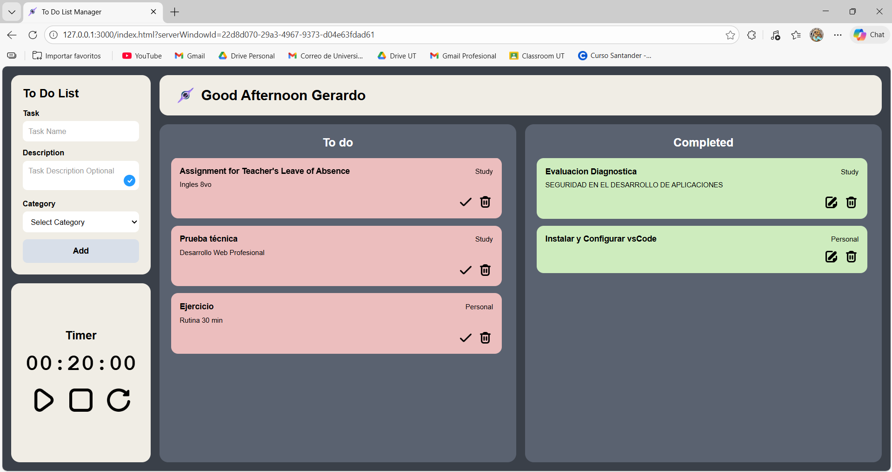

# To Do List Manager

Aplicación web de gestión de tareas desarrollada con HTML5, CSS3 y JavaScript (Vanilla).  
Permite crear, organizar y completar tareas de forma dinámica.

## Capturas de Pantalla

## Funcionalidades Requeridas

- Agregar tareas mediante un formulario.
- Validación para evitar tareas vacías.
- Marcar tareas como completadas.
- Eliminar tareas.
- Actualización dinámica de la interfaz sin recargar la página.
- Uso de eventos con addEventListener.

## Funcionalidades Extra

- Tablero separado para tareas pendientes y completadas.
- Categorías de tareas.
- Descripción opcional de tareas.
- Temporizador integrado.
- Saludo dinámico según la hora del día.
- Diseño visual diferenciado entre tareas completadas y pendientes.

## Tecnologías Utilizadas

- HTML5
- CSS3
- JavaScript (Vanilla)
- Git
- GitHub

Diseño responsive con Flexbox y CSS Grid, adaptado a móviles y escritorio.

## Recursos

- Prototipo en Figma: https://www.figma.com/design/RbIeBbZlDJX5TAThDhDNdPLr/To-Do-List-Task-Manager
- Iconos: Flaticon
- Referencias: 
  - https://www.youtube.com/watch?v=sVSAklXy1uE
  - https://www.youtube.com/watch?v=CsO0UJSqaw0

---

